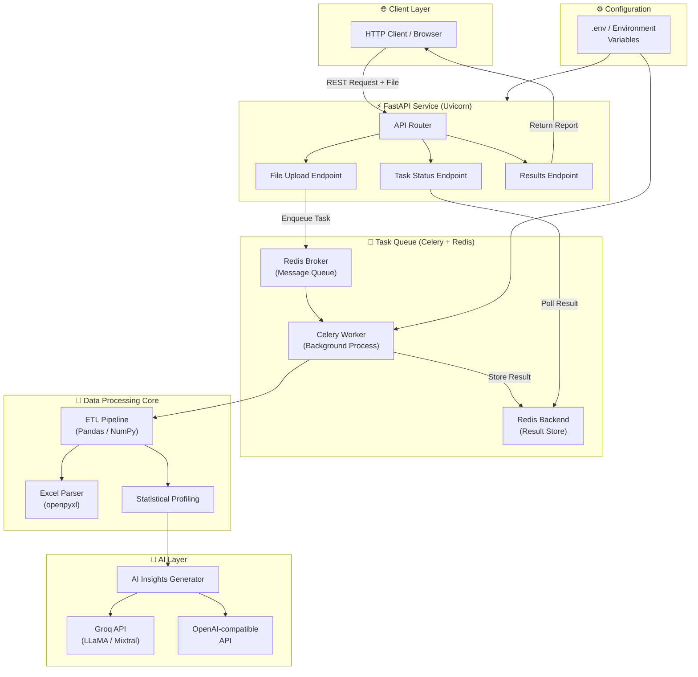
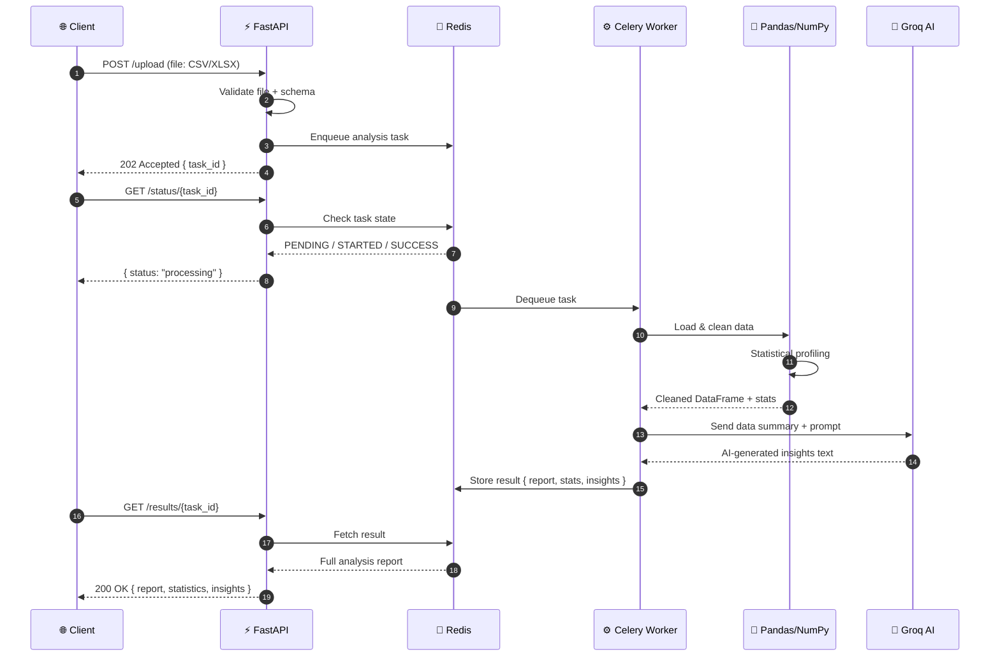
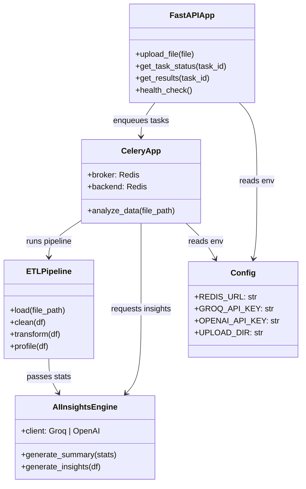
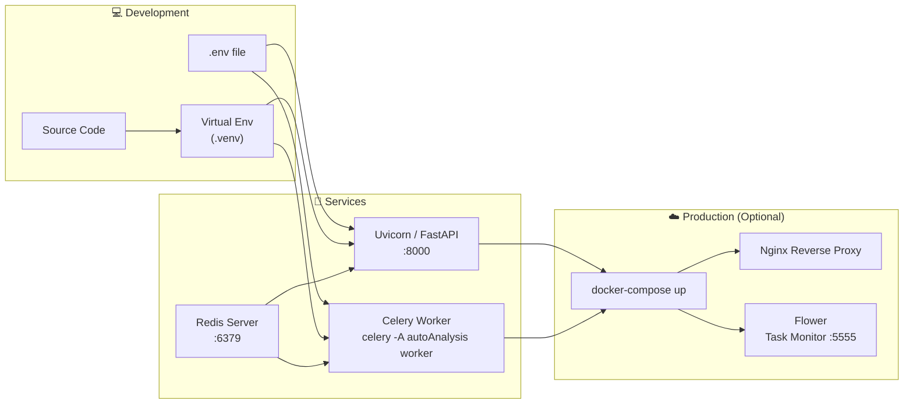

<div align="center">

# ⚡ Automated Data Analysis

### *Intelligent, async-first data pipeline engine powered by AI*

> Upload. Process. Analyze. — From raw data to AI-generated insights in seconds.

[](https://www.python.org/)
[](https://fastapi.tiangolo.com/)
[](https://docs.celeryq.dev/)
[](https://redis.io/)
[](https://groq.com/)
[](LICENSE)
[]()

---

</div>

## 📖 Table of Contents

- [About](#-about)
- [Visual Overview](#-visual-overview)
- [Features](#-features)
- [Tech Stack](#-tech-stack)
- [Project Structure](#-project-structure)
- [Getting Started](#-getting-started)
- [API Reference](#-api-reference)
- [Configuration](#-configuration)
- [Screenshots / Demo](#-screenshots--demo)
- [Contributing](#-contributing)
- [License](#-license)

---

## 🧠 About

**Automated Data Analysis** is a high-performance, async-first backend service that takes raw data files (CSV, Excel, etc.) and runs them through an intelligent ETL pipeline — cleaning, transforming, statistically profiling, and summarizing them using AI language models (Groq / OpenAI-compatible APIs).

Built on **Python 3.12**, **FastAPI**, and **Celery + Redis**, the system handles long-running analysis jobs in the background so your API stays non-blocking and snappy under load.

```
Client → FastAPI (REST) → Celery Task Queue → Redis Broker
                                   ↓
                        Pandas / NumPy / openpyxl
                                   ↓
                        Groq / OpenAI LLM API
                                   ↓
                         AI-powered Analysis Report
```

---

## 📊 Visual Overview

### 🏗️ System Architecture



---

### 🔄 Request & Data Flow



---

### 🧩 Component Relationships



---

### 🚀 Deployment Flow



---

## ✨ Features

### 📥 Data Ingestion
- **Multi-format file upload** — accepts CSV, Excel (`.xlsx`, `.xls`), and plain text datasets
- **Schema detection** — auto-detects column types, date fields, and categorical vs. numerical variables
- **Validation layer** — rejects malformed or oversized uploads with descriptive error messages

### ⚙️ ETL Pipeline
- **Automated cleaning** — handles missing values, duplicate rows, type coercions, and outlier flagging
- **Transformation engine** — powered by Pandas & NumPy for fast, vectorised data reshaping
- **Excel support** — full openpyxl integration for reading multi-sheet workbooks and preserving formatting metadata

### 📈 Statistical Profiling
- **Descriptive statistics** — mean, median, std dev, skewness, kurtosis, percentiles per column
- **Correlation matrix** — identifies relationships between numerical features
- **Distribution analysis** — detects column distributions and flags anomalies

### 🤖 AI-Powered Insights
- **Natural language summaries** — sends statistical profiles to Groq (LLaMA / Mixtral) or any OpenAI-compatible API
- **Pattern discovery** — LLM identifies trends, anomalies, and business-relevant observations
- **Customisable prompts** — analysis framing can be adjusted via environment config

### ⚡ Async Job Processing
- **Non-blocking API** — file uploads return immediately with a `task_id`; analysis runs in the background
- **Celery + Redis task queue** — robust, production-grade job distribution
- **Job status polling** — clients can query `PENDING → STARTED → SUCCESS / FAILURE` transitions in real time
- **Result persistence** — completed reports stored in Redis backend for retrieval

### 🔒 Clean Configuration
- **Env-based config** — all secrets and service URLs managed via `.env` / environment variables
- **No hardcoded credentials** — safe for containerised and cloud deployments

---

## 🛠️ Tech Stack

### Backend

| Technology | Version | Purpose |
|---|---|---|
| Python | 3.12 | Core runtime |
| FastAPI | 0.100+ | Async REST API framework |
| Uvicorn | Latest | ASGI server |
| Pydantic | v2 | Request/response validation & settings |

### Data Processing

| Technology | Version | Purpose |
|---|---|---|
| Pandas | Latest | DataFrame operations & ETL |
| NumPy | Latest | Numerical computations |
| openpyxl | Latest | Excel file reading/writing |

### Task Queue & Messaging

| Technology | Version | Purpose |
|---|---|---|
| Celery | 5.x | Distributed task queue |
| Redis | 7.x | Message broker + result backend |

### AI Integration

| Technology | Purpose |
|---|---|
| Groq API | Ultra-fast LLM inference (LLaMA, Mixtral) |
| OpenAI-compatible API | Pluggable LLM backend |

### Dev Tools

| Tool | Purpose |
|---|---|
| python-dotenv | Environment variable management |
| pip / venv | Dependency & environment management |

---

## 📁 Project Structure

```bash
Automated_Data-Analysis/
│
├── autoAnalysis/                  # 📦 Main Python package
│   ├── __init__.py                # Package initialisation
│   │
│   ├── main.py                    # 🚀 FastAPI app entry point & route definitions
│   │
│   ├── config.py                  # ⚙️  Pydantic settings — reads from .env
│   │
│   ├── tasks.py                   # 🔄 Celery task definitions (analysis pipeline)
│   │
│   ├── worker.py                  # ⚙️  Celery app instance & configuration
│   │
│   ├── pipeline/                  # 🔬 ETL & processing modules
│   │   ├── __init__.py
│   │   ├── loader.py              #    File loading (CSV, Excel)
│   │   ├── cleaner.py             #    Data cleaning & null handling
│   │   ├── transformer.py         #    Data transformations
│   │   └── profiler.py            #    Statistical profiling
│   │
│   ├── ai/                        # 🤖 AI/LLM integration
│   │   ├── __init__.py
│   │   ├── groq_client.py         #    Groq API client wrapper
│   │   └── insights.py            #    Prompt builder & insight extractor
│   │
│   ├── schemas/                   # 📐 Pydantic models
│   │   ├── __init__.py
│   │   ├── request.py             #    Upload request schema
│   │   └── response.py            #    Analysis result schema
│   │
│   └── utils/                     # 🛠️  Shared utilities
│       ├── __init__.py
│       └── file_utils.py          #    File I/O helpers
│
├── dump.rdb                       # 💾 Redis persistence snapshot
├── .env.example                   # 📋 Environment variable template
├── requirements.txt               # 📦 Python dependencies
└── README.md                      # 📖 This file
```

> **Note:** The internal package layout above is inferred from the repository description and standard FastAPI + Celery project conventions. Some sub-module names may differ from the actual source.

---

## 🚀 Getting Started

### Prerequisites

- Python **3.12+**
- Redis server running locally (or via Docker)
- A [Groq API key](https://console.groq.com/) (free tier available)

### 1. Clone the Repository

```bash
git clone https://github.com/AmanJha-1337/Automated_Data-Analysis.git
cd Automated_Data-Analysis
```

### 2. Create & Activate Virtual Environment

```bash
python3.12 -m venv .venv
source .venv/bin/activate        # Linux / macOS
# .venv\Scripts\activate         # Windows
```

### 3. Install Dependencies

```bash
pip install -r autoAnalysis/requirements.txt
```

### 4. Configure Environment Variables

```bash
cp .env.example .env
```

Edit `.env` with your values:

```env
# Redis
REDIS_URL=redis://localhost:6379/0

# AI Provider — choose one or both
GROQ_API_KEY=your_groq_api_key_here
OPENAI_API_KEY=your_openai_api_key_here        # optional
OPENAI_BASE_URL=https://api.openai.com/v1      # or any compatible endpoint

# Upload settings
UPLOAD_DIR=/tmp/autoanalysis_uploads
MAX_FILE_SIZE_MB=50
```

### 5. Start Redis

```bash
# Via Docker (recommended)
docker run -d -p 6379:6379 redis:7

# Or via system package manager
redis-server
```

### 6. Start the Celery Worker

```bash
celery -A autoAnalysis.worker worker --loglevel=info
```

### 7. Start the FastAPI Server

```bash
uvicorn autoAnalysis.main:app --host 0.0.0.0 --port 8000 --reload
```

Visit **[http://localhost:8000/docs](http://localhost:8000/docs)** for the interactive Swagger UI.

---

## 📡 API Reference

### `POST /upload`

Upload a data file for analysis.

```bash
curl -X POST http://localhost:8000/upload \
  -F "file=@data.csv"
```

**Response `202 Accepted`:**
```json
{
  "task_id": "f3ab9c12-4d1e-4b78-a901-2d3e5f6a7b8c",
  "status": "queued",
  "message": "Analysis started in background"
}
```

---

### `GET /status/{task_id}`

Poll the status of a running analysis job.

```bash
curl http://localhost:8000/status/f3ab9c12-4d1e-4b78-a901-2d3e5f6a7b8c
```

**Response:**
```json
{
  "task_id": "f3ab9c12-4d1e-4b78-a901-2d3e5f6a7b8c",
  "status": "STARTED",
  "progress": "Running statistical profiling..."
}
```

---

### `GET /results/{task_id}`

Retrieve the completed analysis report.

```bash
curl http://localhost:8000/results/f3ab9c12-4d1e-4b78-a901-2d3e5f6a7b8c
```

**Response `200 OK`:**
```json
{
  "task_id": "f3ab9c12-...",
  "status": "SUCCESS",
  "report": {
    "rows": 10420,
    "columns": 14,
    "missing_values": { "age": 12, "salary": 0 },
    "statistics": {
      "salary": { "mean": 72400.5, "std": 18200.3, "min": 25000, "max": 210000 }
    },
    "ai_insights": "The dataset shows a right-skewed salary distribution with a notable cluster of high earners in the 45-55 age bracket. Missing values in the 'age' column (0.11%) are unlikely to affect analysis significantly. Strong positive correlation (r=0.74) observed between experience_years and salary..."
  }
}
```

---

### `GET /health`

```bash
curl http://localhost:8000/health
# { "status": "ok", "redis": "connected", "worker": "online" }
```

---

## ⚙️ Configuration

All configuration is managed via environment variables loaded through Pydantic Settings.

| Variable | Required | Default | Description |
|---|---|---|---|
| `REDIS_URL` | ✅ | `redis://localhost:6379/0` | Redis connection string |
| `GROQ_API_KEY` | ✅ | — | Groq API key for LLM inference |
| `OPENAI_API_KEY` | ⬜ | — | OpenAI-compatible API key |
| `OPENAI_BASE_URL` | ⬜ | `https://api.openai.com/v1` | Base URL for OpenAI-compatible provider |
| `UPLOAD_DIR` | ⬜ | `/tmp/uploads` | Directory for temporary file storage |
| `MAX_FILE_SIZE_MB` | ⬜ | `50` | Maximum allowed upload size |
| `CELERY_CONCURRENCY` | ⬜ | `4` | Number of parallel Celery workers |

---

## 🖥️ Screenshots / Demo

> Screenshots will be added here. Below are suggested placeholders:

```
<!-- API Swagger UI -->


<!-- Celery Worker Terminal Output -->


<!-- Sample Analysis Report JSON -->

```

To generate a demo analysis locally:

```bash
# Using the provided sample dataset
curl -X POST http://localhost:8000/upload \
  -F "file=@sample_data.csv" | jq .

# Then poll until complete:
curl http://localhost:8000/results/<task_id> | jq .report.ai_insights
```

---

## 🤝 Contributing

Contributions are welcome! Here's how to get started:

```bash
# Fork the repo, then:
git checkout -b feature/your-feature-name
git commit -m "feat: add your feature"
git push origin feature/your-feature-name
# Open a Pull Request
```

Please follow:
- [PEP 8](https://pep8.org/) for code style
- Conventional Commits for commit messages
- Add tests for any new pipeline logic

---

## 📄 License

This project is licensed under the **MIT License** — see the [LICENSE](LICENSE) file for details.

---

<div align="center">

Built with ❤️ by [AmanJha-1337](https://github.com/AmanJha-1337)

⭐ Star this repo if you found it useful!

</div>
