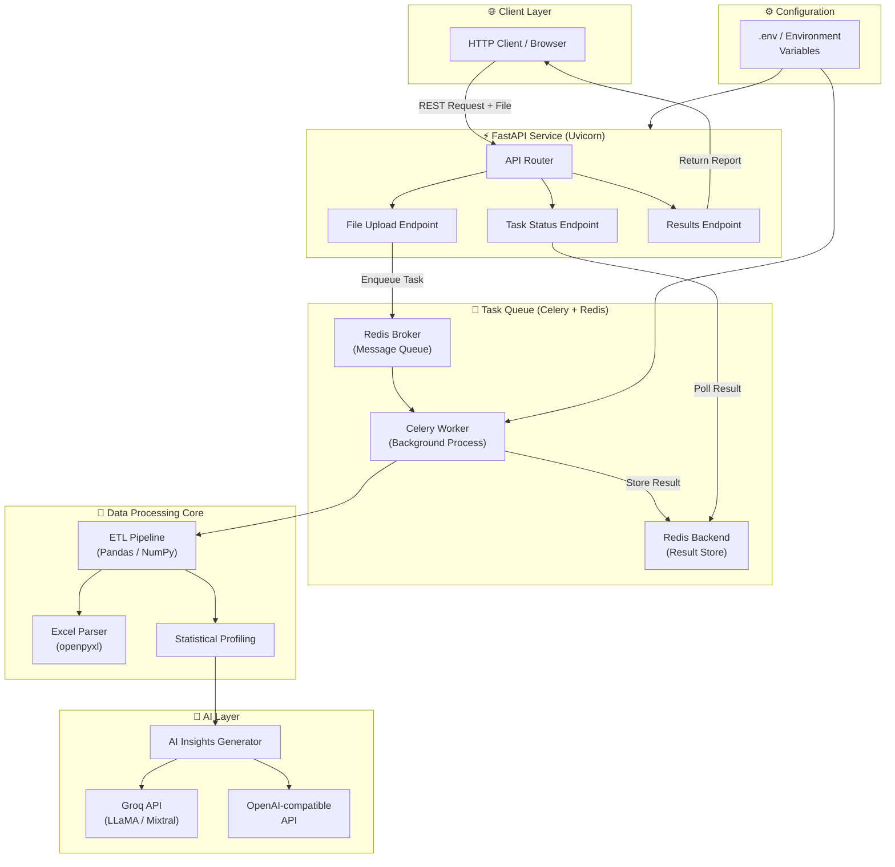
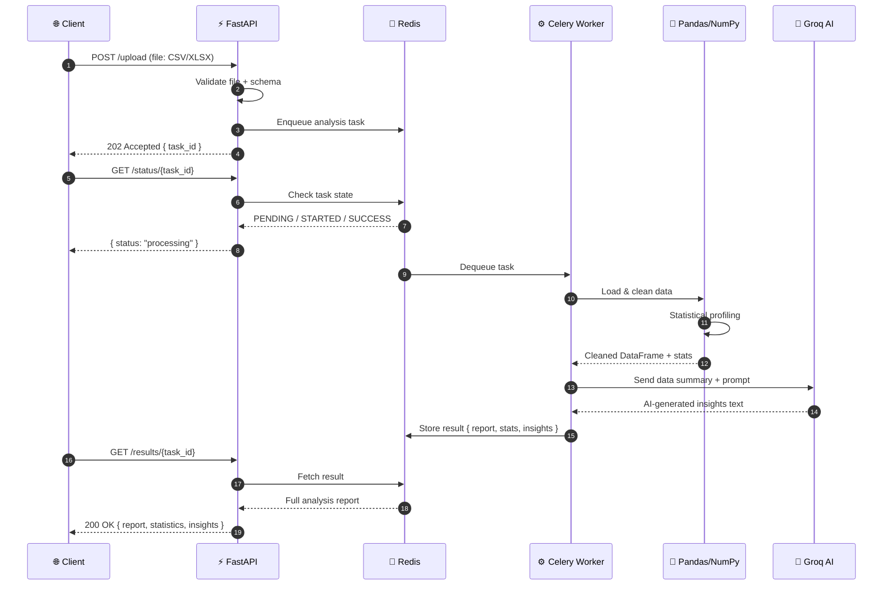
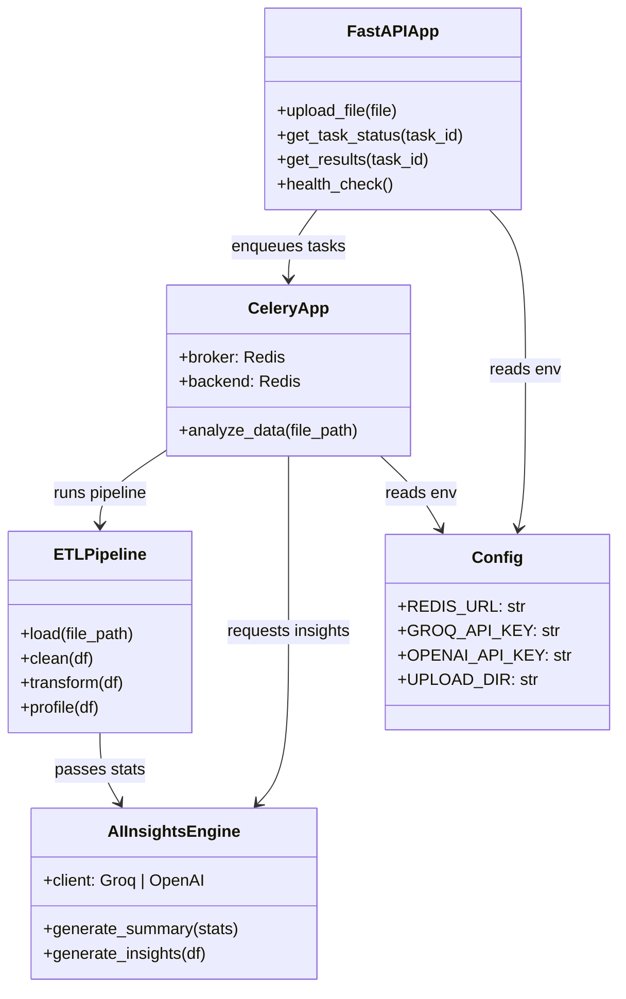
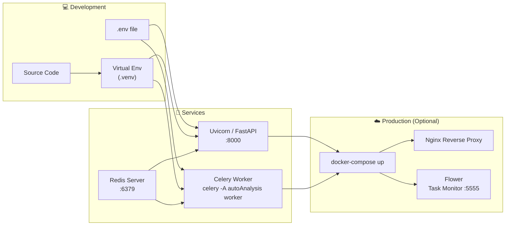
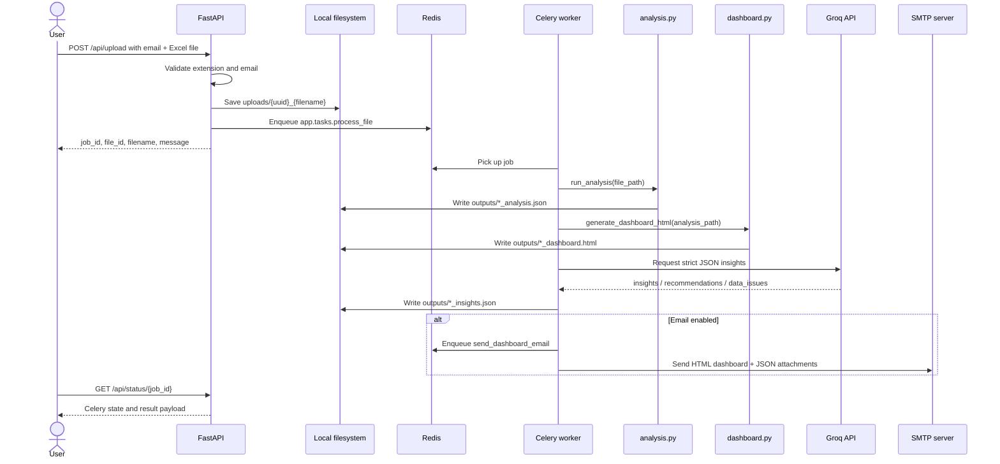
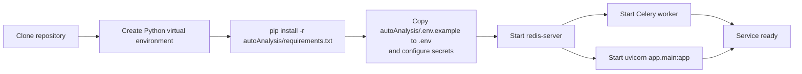
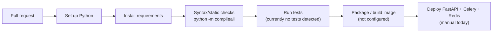
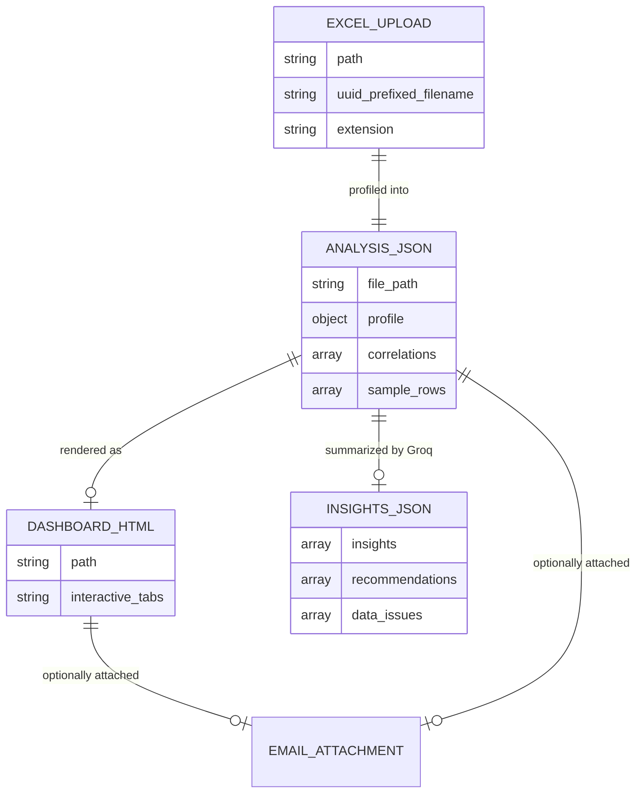

<div align="center">

# ⚡ Automated Data Analysis

### *Intelligent, async-first data pipeline engine powered by AI*

> Upload. Process. Analyze. — From raw data to AI-generated insights in seconds.

[](https://www.python.org/)
[](https://fastapi.tiangolo.com/)
[](https://docs.celeryq.dev/)
[](https://redis.io/)
[](https://groq.com/)
[](LICENSE)
[]()

---

</div>

## 📖 Table of Contents

- [About](#-about)
- [Visual Overview](#-visual-overview)
- [Features](#-features)
- [Tech Stack](#-tech-stack)
- [Project Structure](#-project-structure)
- [Getting Started](#-getting-started)
- [API Reference](#-api-reference)
- [Configuration](#-configuration)
- [Screenshots / Demo](#-screenshots--demo)
- [Contributing](#-contributing)
- [License](#-license)

---

## 🧠 About

**Automated Data Analysis** is a high-performance, async-first backend service that takes raw data files (CSV, Excel, etc.) and runs them through an intelligent ETL pipeline — cleaning, transforming, statistically profiling, and summarizing them using AI language models (Groq / OpenAI-compatible APIs).

Built on **Python 3.12**, **FastAPI**, and **Celery + Redis**, the system handles long-running analysis jobs in the background so your API stays non-blocking and snappy under load.

```
Client → FastAPI (REST) → Celery Task Queue → Redis Broker
                                   ↓
                        Pandas / NumPy / openpyxl
                                   ↓
                        Groq / OpenAI LLM API
                                   ↓
                         AI-powered Analysis Report
```

---

## 📊 Visual Overview

### 🏗️ System Architecture



---

### 🔄 Request & Data Flow



---

### 🧩 Component Relationships



---

### 🚀 Deployment Flow



---

## ✨ Features

### 📥 Data Ingestion
- **Multi-format file upload** — accepts CSV, Excel (`.xlsx`, `.xls`), and plain text datasets
- **Schema detection** — auto-detects column types, date fields, and categorical vs. numerical variables
- **Validation layer** — rejects malformed or oversized uploads with descriptive error messages

### ⚙️ ETL Pipeline
- **Automated cleaning** — handles missing values, duplicate rows, type coercions, and outlier flagging
- **Transformation engine** — powered by Pandas & NumPy for fast, vectorised data reshaping
- **Excel support** — full openpyxl integration for reading multi-sheet workbooks and preserving formatting metadata

### 📈 Statistical Profiling
- **Descriptive statistics** — mean, median, std dev, skewness, kurtosis, percentiles per column
- **Correlation matrix** — identifies relationships between numerical features
- **Distribution analysis** — detects column distributions and flags anomalies

### 🤖 AI-Powered Insights
- **Natural language summaries** — sends statistical profiles to Groq (LLaMA / Mixtral) or any OpenAI-compatible API
- **Pattern discovery** — LLM identifies trends, anomalies, and business-relevant observations
- **Customisable prompts** — analysis framing can be adjusted via environment config

### ⚡ Async Job Processing
- **Non-blocking API** — file uploads return immediately with a `task_id`; analysis runs in the background
- **Celery + Redis task queue** — robust, production-grade job distribution
- **Job status polling** — clients can query `PENDING → STARTED → SUCCESS / FAILURE` transitions in real time
- **Result persistence** — completed reports stored in Redis backend for retrieval

### 🔒 Clean Configuration
- **Env-based config** — all secrets and service URLs managed via `.env` / environment variables
- **No hardcoded credentials** — safe for containerised and cloud deployments

---

## 🛠️ Tech Stack

### Backend

| Technology | Version | Purpose |
|---|---|---|
| Python | 3.12 | Core runtime |
| FastAPI | 0.100+ | Async REST API framework |
| Uvicorn | Latest | ASGI server |
| Pydantic | v2 | Request/response validation & settings |

### Data Processing

| Technology | Version | Purpose |
|---|---|---|
| Pandas | Latest | DataFrame operations & ETL |
| NumPy | Latest | Numerical computations |
| openpyxl | Latest | Excel file reading/writing |

### Task Queue & Messaging

| Technology | Version | Purpose |
|---|---|---|
| Celery | 5.x | Distributed task queue |
| Redis | 7.x | Message broker + result backend |

### AI Integration

| Technology | Purpose |
|---|---|
| Groq API | Ultra-fast LLM inference (LLaMA, Mixtral) |
| OpenAI-compatible API | Pluggable LLM backend |

### Dev Tools

| Tool | Purpose |
|---|---|
| python-dotenv | Environment variable management |
| pip / venv | Dependency & environment management |

---

## 📁 Project Structure

```bash
Automated_Data-Analysis/
│
├── autoAnalysis/                  # 📦 Main Python package
│   ├── __init__.py                # Package initialisation
│   │
│   ├── main.py                    # 🚀 FastAPI app entry point & route definitions
│   │
│   ├── config.py                  # ⚙️  Pydantic settings — reads from .env
│   │
│   ├── tasks.py                   # 🔄 Celery task definitions (analysis pipeline)
│   │
│   ├── worker.py                  # ⚙️  Celery app instance & configuration
│   │
│   ├── pipeline/                  # 🔬 ETL & processing modules
│   │   ├── __init__.py
│   │   ├── loader.py              #    File loading (CSV, Excel)
│   │   ├── cleaner.py             #    Data cleaning & null handling
│   │   ├── transformer.py         #    Data transformations
│   │   └── profiler.py            #    Statistical profiling
│   │
│   ├── ai/                        # 🤖 AI/LLM integration
│   │   ├── __init__.py
│   │   ├── groq_client.py         #    Groq API client wrapper
│   │   └── insights.py            #    Prompt builder & insight extractor
│   │
│   ├── schemas/                   # 📐 Pydantic models
│   │   ├── __init__.py
│   │   ├── request.py             #    Upload request schema
│   │   └── response.py            #    Analysis result schema
│   │
│   └── utils/                     # 🛠️  Shared utilities
│       ├── __init__.py
│       └── file_utils.py          #    File I/O helpers
│
├── dump.rdb                       # 💾 Redis persistence snapshot
├── .env.example                   # 📋 Environment variable template
├── requirements.txt               # 📦 Python dependencies
└── README.md                      # 📖 This file
```

> **Note:** The internal package layout above is inferred from the repository description and standard FastAPI + Celery project conventions. Some sub-module names may differ from the actual source.

---

## 🚀 Getting Started

### Prerequisites

- Python **3.12+**
- Redis server running locally (or via Docker)
- A [Groq API key](https://console.groq.com/) (free tier available)

### 1. Clone the Repository

```bash
git clone https://github.com/AmanJha-1337/Automated_Data-Analysis.git
cd Automated_Data-Analysis
```

### 2. Create & Activate Virtual Environment

```bash
python3.12 -m venv .venv
source .venv/bin/activate        # Linux / macOS
# .venv\Scripts\activate         # Windows
```

### 3. Install Dependencies

```bash
pip install -r autoAnalysis/requirements.txt
```

### 4. Configure Environment Variables

```bash
cp .env.example .env
```

Edit `.env` with your values:

```env
# Redis
REDIS_URL=redis://localhost:6379/0

# AI Provider — choose one or both
GROQ_API_KEY=your_groq_api_key_here
OPENAI_API_KEY=your_openai_api_key_here        # optional
OPENAI_BASE_URL=https://api.openai.com/v1      # or any compatible endpoint

# Upload settings
UPLOAD_DIR=/tmp/autoanalysis_uploads
MAX_FILE_SIZE_MB=50
```

### 5. Start Redis

```bash
# Via Docker (recommended)
docker run -d -p 6379:6379 redis:7

# Or via system package manager
redis-server
```

### 6. Start the Celery Worker

```bash
celery -A autoAnalysis.worker worker --loglevel=info
```

### 7. Start the FastAPI Server

```bash
uvicorn autoAnalysis.main:app --host 0.0.0.0 --port 8000 --reload
```

Visit **[http://localhost:8000/docs](http://localhost:8000/docs)** for the interactive Swagger UI.

---

## 📡 API Reference

### `POST /upload`

Upload a data file for analysis.

```bash
curl -X POST http://localhost:8000/upload \
  -F "file=@data.csv"
```

**Response `202 Accepted`:**
```json
{
  "task_id": "f3ab9c12-4d1e-4b78-a901-2d3e5f6a7b8c",
  "status": "queued",
  "message": "Analysis started in background"
}
```

---

### `GET /status/{task_id}`

Poll the status of a running analysis job.

```bash
curl http://localhost:8000/status/f3ab9c12-4d1e-4b78-a901-2d3e5f6a7b8c
```

**Response:**
```json
{
  "task_id": "f3ab9c12-4d1e-4b78-a901-2d3e5f6a7b8c",
  "status": "STARTED",
  "progress": "Running statistical profiling..."
}
```

---

### `GET /results/{task_id}`

Retrieve the completed analysis report.

```bash
curl http://localhost:8000/results/f3ab9c12-4d1e-4b78-a901-2d3e5f6a7b8c
```

**Response `200 OK`:**
```json
{
  "task_id": "f3ab9c12-...",
  "status": "SUCCESS",
  "report": {
    "rows": 10420,
    "columns": 14,
    "missing_values": { "age": 12, "salary": 0 },
    "statistics": {
      "salary": { "mean": 72400.5, "std": 18200.3, "min": 25000, "max": 210000 }
    },
    "ai_insights": "The dataset shows a right-skewed salary distribution with a notable cluster of high earners in the 45-55 age bracket. Missing values in the 'age' column (0.11%) are unlikely to affect analysis significantly. Strong positive correlation (r=0.74) observed between experience_years and salary..."
  }
}
```

---

### `GET /health`

```bash
curl http://localhost:8000/health
# { "status": "ok", "redis": "connected", "worker": "online" }
```

---

## ⚙️ Configuration

All configuration is managed via environment variables loaded through Pydantic Settings.

| Variable | Required | Default | Description |
|---|---|---|---|
| `REDIS_URL` | ✅ | `redis://localhost:6379/0` | Redis connection string |
| `GROQ_API_KEY` | ✅ | — | Groq API key for LLM inference |
| `OPENAI_API_KEY` | ⬜ | — | OpenAI-compatible API key |
| `OPENAI_BASE_URL` | ⬜ | `https://api.openai.com/v1` | Base URL for OpenAI-compatible provider |
| `UPLOAD_DIR` | ⬜ | `/tmp/uploads` | Directory for temporary file storage |
| `MAX_FILE_SIZE_MB` | ⬜ | `50` | Maximum allowed upload size |
| `CELERY_CONCURRENCY` | ⬜ | `4` | Number of parallel Celery workers |

---

## 🖥️ Screenshots / Demo

> Screenshots will be added here. Below are suggested placeholders:

```
<!-- API Swagger UI -->


<!-- Celery Worker Terminal Output -->


<!-- Sample Analysis Report JSON -->

```

To generate a demo analysis locally:

```bash
# Using the provided sample dataset
curl -X POST http://localhost:8000/upload \
  -F "file=@sample_data.csv" | jq .

# Then poll until complete:
curl http://localhost:8000/results/<task_id> | jq .report.ai_insights
```

---

## 🤝 Contributing

Contributions are welcome! Here's how to get started:

```bash
# Fork the repo, then:
git checkout -b feature/your-feature-name
git commit -m "feat: add your feature"
git push origin feature/your-feature-name
# Open a Pull Request
```

Please follow:
- [PEP 8](https://pep8.org/) for code style
- Conventional Commits for commit messages
- Add tests for any new pipeline logic

---

## 📄 License

This project is licensed under the **MIT License** — see the [LICENSE](LICENSE) file for details.

---

<div align="center">

Built with ❤️ by [AmanJha-1337](https://github.com/AmanJha-1337)

⭐ Star this repo if you found it useful!

</div>

<div align="center">

# 📊 Automated Data Analysis

**Upload an Excel workbook, profile the data asynchronously, generate an interactive HTML dashboard, and optionally deliver the report by email.**

_An approachable FastAPI + Celery data-analysis service for turning `.xlsx` / `.xls` files into statistical summaries, dashboards, and Groq-powered insights._

[](https://www.python.org/)
[](https://fastapi.tiangolo.com/)
[](https://docs.celeryq.dev/)
[](https://redis.io/)
[](https://pandas.pydata.org/)
[](https://groq.com/)

</div>

---

## ✨ What This Project Does

Automated Data Analysis is a Python backend application that accepts Excel uploads through a small web form or API endpoint, stores each upload on disk, sends the job to Celery, computes a statistical profile with Pandas/NumPy, generates a standalone interactive dashboard HTML file, asks Groq for JSON-formatted insights, and can email the dashboard plus analysis JSON to the user when SMTP is configured.

> **Repository reality check:** this project currently contains a backend service and generated sample artifacts. No separate React/Vue/Angular frontend, Dockerfile, relational database schema, or committed CI workflow was detected.

---

## 🧭 Visual Overview

### System Architecture

```mermaid
flowchart TB
    User["User / API Client"] -->|Browser form or multipart POST| FastAPI["FastAPI app\napp/main.py"]
    FastAPI -->|Save uploaded .xls/.xlsx| Uploads[("uploads/\nExcel files")]
    FastAPI -->|process_file.delay(...)| Redis[("Redis\nCelery broker + result backend")]
    Redis --> Worker["Celery worker\napp/tasks.py"]
    Worker --> Analysis["Pandas/NumPy analyzer\napp/analysis.py"]
    Analysis --> Outputs[("outputs/\nanalysis JSON")]
    Worker --> Dashboard["Dashboard generator\napp/dashboard.py"]
    Dashboard --> Outputs
    Worker --> Groq["Groq Chat Completions\napp/ai.py"]
    Groq --> Outputs
    Worker -->|optional| Email["SMTP email service\napp/services/email_service.py"]
    Email --> User
    User -->|GET /api/status/{job_id}| FastAPI
    User -->|GET /api/result/file?path=...| FastAPI
```

### Request & Data Flow



### Component Relationships

```mermaid
classDiagram
    class main_py {
      +FastAPI app
      +GET /()
      +POST /api/upload(file,email)
      +GET /api/status/{job_id}
      +GET /api/result/file(path)
    }
    class tasks_py {
      +celery_app
      +process_file(file_path,user_email)
      +send_dashboard_email(...)
    }
    class analysis_py {
      +read_excel(file_path)
      +basic_profile(df)
      +top_correlations(df)
      +sample_rows(df)
      +analyze_excel(file_path)
      +run_analysis(file_path)
    }
    class dashboard_py {
      +generate_dashboard_html(analysis_json_path)
      +get_all_dashboards()
    }
    class ai_py {
      +build_prompt(analysis_json)
      +call_groq_for_insights(analysis_path)
    }
    class email_service_py {
      +EmailService
      +send_dashboard_email(...)
    }
    class config_py {
      +Settings
      +settings
    }

    main_py --> tasks_py : queues process_file
    tasks_py --> analysis_py : creates analysis JSON
    tasks_py --> dashboard_py : creates dashboard HTML
    tasks_py --> ai_py : creates Groq insights JSON
    tasks_py --> email_service_py : optional email delivery
    main_py --> config_py : reads settings
    tasks_py --> config_py : Redis/email paths
    analysis_py --> config_py : output directory
    dashboard_py --> config_py : output directory
    email_service_py --> config_py : SMTP settings
```

### Deployment Flow



### CI/CD Pipeline

No GitHub Actions, GitLab CI, or other CI/CD configuration is currently committed. The diagram below documents a sensible pipeline for this repository rather than an existing automated workflow.



### Data & Artifact Relationships

This project does not define a relational database model. Redis is used by Celery as a broker/result backend, while uploads and generated outputs are stored as local files.



---

## 🚀 Features

<table>
<tr>
<td width="50%">

### 📤 Excel Upload API
- Browser upload form at `/`
- `POST /api/upload` endpoint
- Accepts `.xlsx` and `.xls`
- Requires an email field
- Saves files with UUID-prefixed names

</td>
<td width="50%">

### ⚙️ Background Processing
- Celery task queue
- Redis broker and result backend
- Job status endpoint at `/api/status/{job_id}`
- Non-blocking upload response with `job_id`

</td>
</tr>
<tr>
<td width="50%">

### 📈 Statistical Profiling
- Row and column counts
- Per-column dtype, non-null, null, and unique counts
- Numeric mean, median, standard deviation, min, and max
- Top categorical values
- Top absolute correlations for numeric columns
- First five sample rows

</td>
<td width="50%">

### 🧾 Generated Artifacts
- `*_analysis.json` statistical reports
- `*_dashboard.html` standalone dashboards
- `*_insights.json` Groq AI outputs when successful
- File download endpoint constrained to `OUTPUT_DIR`

</td>
</tr>
<tr>
<td width="50%">

### 🖥️ Interactive HTML Dashboards
- Overview metric cards
- Numeric column tab
- Categorical column tab
- Correlation tab
- Sample data tab
- Self-contained HTML/CSS/JavaScript output

</td>
<td width="50%">

### 📧 Optional Email Delivery
- SMTP-backed report delivery
- HTML email body
- Dashboard and analysis JSON attachments
- Toggle with `ENABLE_EMAIL`
- Gmail app-password workflow documented in project docs

</td>
</tr>
<tr>
<td width="50%">

### 🤖 Groq-Powered Insights
- Uses the Groq Python client
- Configurable `GROQ_MODEL`
- Requests strict JSON containing `insights`, `recommendations`, and `data_issues`

</td>
<td width="50%">

### 🧩 Dashboard Management Module
- `app/api/dashboard_routes.py` contains dashboard list/generate/view endpoints
- **Assumption / caveat:** these routes are not currently included in `app/main.py`, so wire them with `app.include_router(...)` before using them through FastAPI.

</td>
</tr>
</table>

---

## 🛠️ Tech Stack

### Frontend / User Interface

| Category | Technology | Where Used | Notes |
|---|---|---|---|
| Server-rendered UI | Inline HTML/CSS | `app/main.py` | Upload form at `/` |
| Dashboard UI | HTML, CSS, vanilla JavaScript | `app/dashboard.py` | Generated standalone dashboard files |
| Frontend framework | None detected | — | No React/Vue/Angular app is committed |

### Backend

| Category | Technology | Version / Source | Purpose |
|---|---|---|---|
| Web framework | FastAPI | `fastapi==0.100.0` | API and upload form |
| ASGI server | Uvicorn | `uvicorn[standard]==0.22.0` | Local development server |
| Background jobs | Celery | `celery==5.3.0` | Asynchronous file processing and email task |
| Settings | Pydantic Settings + python-dotenv | `pydantic-settings`, `python-dotenv` | Environment-based configuration |
| File uploads | python-multipart | `python-multipart==0.0.6` | Multipart form parsing |

### Data, AI & Analytics

| Category | Technology | Version / Source | Purpose |
|---|---|---|---|
| Dataframes | Pandas | `pandas==2.2.3` | Excel loading and profiling |
| Numeric operations | NumPy | `numpy==1.26.4` | Numeric column selection and correlations |
| Excel engine | openpyxl | `openpyxl==3.1.4` | Excel parsing fallback/engine |
| ML dependency | scikit-learn | `scikit-learn==1.4.2` | Installed but not currently used by source code |
| LLM provider | Groq | `groq` | AI insights from analysis JSON |
| OpenAI client | openai | `openai==1.7.0` | Installed but not currently used by source code |

### Database / Persistence

| Category | Technology | Purpose | Notes |
|---|---|---|---|
| Queue backend | Redis | Celery broker and result backend | Configured by `REDIS_URL` |
| File storage | Local filesystem | Uploaded files and generated outputs | `UPLOAD_DIR`, `OUTPUT_DIR` |
| Relational DB | None detected | — | No SQL models/migrations are committed |

### Infrastructure & Deployment

| Category | Technology | Purpose | Status |
|---|---|---|---|
| Process runtime | Python processes | Run FastAPI and Celery worker | Manual commands documented below |
| Message broker | Redis server | Queue/result transport | Required for normal async workflow |
| Containerization | Docker | Not detected | No Dockerfile or compose file committed |
| Reverse proxy | Nginx/Caddy/etc. | Not detected | Add separately for production |

### Dev Tools, Testing & Documentation

| Category | Technology | Status |
|---|---|---|
| Package install | `pip` + `requirements.txt` | Present |
| Tests | Automated test suite | Not detected |
| Static checks | `python -m compileall` | Useful baseline check |
| Documentation | Markdown guides | Dashboard, email, implementation, and visual guides under `autoAnalysis/` |
| CI/CD | GitHub Actions / other workflows | Not detected |

---

## 🖼️ Screenshots / Demo

No committed image assets (`.png`, `.jpg`, `.jpeg`, `.gif`, `.svg`, or `.webp`) were detected. The application does include a live upload page and generated HTML dashboards.

Suggested placeholders until screenshots are added:

```md


```

Recommended demo flow:

1. Start Redis, Celery, and FastAPI.
2. Open `http://localhost:8000/`.
3. Enter an email address and upload an Excel file.
4. Poll `GET /api/status/{job_id}`.
5. Open or download the generated dashboard from `outputs/`.

---

## 📁 Project Structure

```bash
.
├── README.md                         # Project overview and operating guide
├── dump.rdb                          # Redis dump artifact committed at repository root
└── autoAnalysis/
    ├── .env                          # Local environment file (do not commit real secrets)
    ├── .env.example                  # Environment variable template
    ├── requirements.txt              # Python runtime dependencies
    ├── DASHBOARD_GUIDE.md            # Dashboard feature usage guide
    ├── EMAIL_FEATURE_QUICKSTART.md   # Email feature quick start
    ├── EMAIL_SETUP.md                # SMTP configuration guide
    ├── IMPLEMENTATION_SUMMARY.md     # Implementation notes
    ├── VISUAL_GUIDE.md               # Visual workflow documentation
    ├── dump.rdb                      # Redis dump artifact inside app folder
    ├── app/
    │   ├── __init__.py
    │   ├── main.py                   # FastAPI app, upload form, upload/status/download endpoints
    │   ├── config.py                 # Pydantic settings loaded from environment/.env
    │   ├── tasks.py                  # Celery app and background tasks
    │   ├── analysis.py               # Excel loading and statistical profiling
    │   ├── dashboard.py              # Standalone HTML dashboard generator
    │   ├── ai.py                     # Groq prompt construction and insights generation
    │   ├── groq_test.py              # Minimal Groq client smoke test
    │   ├── api/
    │   │   └── dashboard_routes.py   # Optional dashboard management router
    │   └── services/
    │       ├── __init__.py
    │       └── email_service.py      # SMTP email sender and attachment handling
    ├── uploads/                      # Uploaded Excel files (sample/runtime artifacts)
    └── outputs/                      # Generated analysis, dashboard, and insights files
```

> **Production note:** `uploads/`, `outputs/`, `.env`, and Redis `dump.rdb` files are runtime/local artifacts. In a production repository, these are commonly excluded from version control unless intentionally included as examples.

---

## ⚡ Quick Start

### 1. Prerequisites

- Python 3.10+
- Redis server available locally or remotely
- A Groq API key
- Optional: SMTP credentials if you want email delivery

### 2. Clone and enter the app directory

```bash
git clone <your-repository-url>
cd Automated_Data-Analysis/autoAnalysis
```

### 3. Create a virtual environment

```bash
python -m venv .venv
source .venv/bin/activate  # Windows: .venv\Scripts\activate
```

### 4. Install dependencies

```bash
pip install -r requirements.txt
```

### 5. Configure environment variables

```bash
cp .env.example .env
```

Edit `.env`:

```env
GROQ_API_KEY=your_groq_api_key_here
GROQ_MODEL=llama3-8b-8192
REDIS_URL=redis://localhost:6379/0
UPLOAD_DIR=uploads
OUTPUT_DIR=outputs

# Optional email delivery
SMTP_SERVER=smtp.gmail.com
SMTP_PORT=587
SENDER_EMAIL=your_email@gmail.com
SENDER_PASSWORD=your_app_password_here
ENABLE_EMAIL=True
```

### 6. Start Redis

```bash
redis-server --port 6379
```

### 7. Start the Celery worker

Open a second terminal:

```bash
cd autoAnalysis
python -m celery -A app.tasks.celery_app worker --loglevel=info --pool=solo
```

### 8. Start FastAPI

Open a third terminal:

```bash
cd autoAnalysis
python -m uvicorn app.main:app --reload
```

Visit:

- Upload form: `http://localhost:8000/`
- Interactive API docs: `http://localhost:8000/docs`

---

## 🔌 API Reference

### `GET /`

Returns the built-in HTML upload form.

### `POST /api/upload`

Uploads an Excel file and queues background analysis.

| Field | Type | Required | Description |
|---|---:|---:|---|
| `file` | file | Yes | `.xlsx` or `.xls` workbook |
| `email` | string | Yes | Recipient email address |

Example:

```bash
curl -X POST http://localhost:8000/api/upload \
  -F "email=user@example.com" \
  -F "file=@/path/to/workbook.xlsx"
```

Example response shape:

```json
{
  "job_id": "<celery-task-id>",
  "file_id": "<uuid>",
  "filename": "<uuid>_workbook.xlsx",
  "email": "user@example.com",
  "message": "File uploaded. Processing started. Dashboard will be emailed to you when ready."
}
```

### `GET /api/status/{job_id}`

Returns Celery task state and, on success, the result object from `process_file`.

```bash
curl http://localhost:8000/api/status/<job_id>
```

### `GET /api/result/file?path=<output_path>`

Downloads a generated file under `OUTPUT_DIR`. The endpoint rejects paths outside the configured output directory.

```bash
curl -OJ "http://localhost:8000/api/result/file?path=outputs/example_analysis.json"
```

### Optional dashboard router

`autoAnalysis/app/api/dashboard_routes.py` defines these endpoints, but they are not currently registered in `app/main.py`:

| Method | Path | Purpose |
|---|---|---|
| `GET` | `/dashboard/list-analysis-files` | List available `*_analysis.json` files |
| `POST` | `/dashboard/generate/{analysis_file}` | Generate an HTML dashboard from an analysis file |
| `GET` | `/dashboard/view/{dashboard_file}` | Serve a generated dashboard HTML file |
| `GET` | `/dashboard/list` | List generated dashboards |

To enable them, add this to `app/main.py` after `app = FastAPI(...)`:

```python
from app.api.dashboard_routes import router as dashboard_router

app.include_router(dashboard_router)
```

---

## 🔐 Configuration

| Variable | Default | Required | Description |
|---|---|---:|---|
| `GROQ_API_KEY` | — | Yes | API key used by the Groq client |
| `GROQ_MODEL` | `llama3-8b-8192` | No | Groq chat model used for insights |
| `REDIS_URL` | `redis://localhost:6379/0` | No | Celery broker and result backend URL |
| `UPLOAD_DIR` | `uploads` | No | Directory for uploaded Excel files |
| `OUTPUT_DIR` | `outputs` | No | Directory for generated JSON/HTML artifacts |
| `SMTP_SERVER` | `smtp.gmail.com` | No | SMTP server hostname |
| `SMTP_PORT` | `587` | No | SMTP port |
| `SENDER_EMAIL` | empty | Required for email | Sender address |
| `SENDER_PASSWORD` | empty | Required for email | SMTP/app password |
| `ENABLE_EMAIL` | `False` | No | Enables/disables email task dispatch |

---

## 🧪 Quality Checks

There is no committed test suite yet. Useful baseline checks:

```bash
# Verify Python syntax for the application package
python -m compileall autoAnalysis/app

# If services are running, manually test the upload endpoint
curl -X POST http://localhost:8000/api/upload \
  -F "email=user@example.com" \
  -F "file=@/path/to/workbook.xlsx"
```

Suggested future test coverage:

- Unit tests for `basic_profile`, `top_correlations`, and timestamp conversion
- FastAPI tests for upload validation and status responses
- Celery task tests with eager mode
- Dashboard generator snapshot tests
- Email service tests with SMTP mocking

---

## 🚢 Deployment Notes

A production deployment should run at least three services:

1. **FastAPI web process**
   ```bash
   python -m uvicorn app.main:app --host 0.0.0.0 --port 8000
   ```
2. **Celery worker**
   ```bash
   python -m celery -A app.tasks.celery_app worker --loglevel=info
   ```
3. **Redis**
   ```bash
   redis-server
   ```

Recommended production hardening:

- Replace permissive CORS (`allow_origins=["*"]`) with trusted origins.
- Store secrets in a secret manager or deployment platform environment variables, not in `.env` committed to git.
- Add authentication/authorization before accepting sensitive datasets.
- Add file size limits, content scanning, and retention policies for uploads/outputs.
- Use durable object storage for generated reports if running multiple app instances.
- Put FastAPI behind HTTPS and a reverse proxy/load balancer.
- Add CI, tests, formatting, linting, and container images.

---

## 🧯 Troubleshooting

| Symptom | Likely Cause | Fix |
|---|---|---|
| Upload returns a job but never completes | Redis or Celery worker is not running | Start Redis and the Celery worker, then retry |
| `GROQ_API_KEY` validation error on startup | Required environment variable missing | Copy `.env.example` to `.env` and set `GROQ_API_KEY` |
| AI insights are missing | Groq request failed or returned invalid JSON | Check worker logs and the `insights_error` field in job result |
| Email is not sent | `ENABLE_EMAIL` false, sender missing, SMTP auth issue, or dashboard generation failed | Verify `.env`, app password, worker logs, and dashboard path |
| Dashboard endpoints return 404 | Optional dashboard router is not registered | Add `app.include_router(dashboard_router)` to `app/main.py` |
| Download endpoint returns 403 | Path is outside `OUTPUT_DIR` | Pass a generated path under the configured output directory |

---

## 🗺️ Roadmap Ideas

These are not currently implemented, but they would strengthen the project:

- Add automated tests and GitHub Actions.
- Add Dockerfile and Docker Compose for FastAPI + Celery + Redis.
- Register the dashboard router in the main app or remove unused routes.
- Add structured logging and observability.
- Add authentication, upload limits, and data retention controls.
- Add a dedicated frontend or polish the server-rendered UI.
- Add support for CSV/Parquet and multi-sheet Excel workbooks.

---

## 📚 Additional Documentation

- [`autoAnalysis/DASHBOARD_GUIDE.md`](autoAnalysis/DASHBOARD_GUIDE.md) — dashboard generation details
- [`autoAnalysis/EMAIL_FEATURE_QUICKSTART.md`](autoAnalysis/EMAIL_FEATURE_QUICKSTART.md) — email feature quick start
- [`autoAnalysis/EMAIL_SETUP.md`](autoAnalysis/EMAIL_SETUP.md) — SMTP setup guide
- [`autoAnalysis/IMPLEMENTATION_SUMMARY.md`](autoAnalysis/IMPLEMENTATION_SUMMARY.md) — implementation summary
- [`autoAnalysis/VISUAL_GUIDE.md`](autoAnalysis/VISUAL_GUIDE.md) — visual workflow guide

---

## 🤝 Contributing

1. Fork the repository.
2. Create a feature branch.
3. Install dependencies and run checks.
4. Keep generated runtime artifacts out of unrelated changes.
5. Open a pull request with a clear description and test results.

---

## 📄 License

No license file was detected in this repository. Add a `LICENSE` file before publishing if you want others to know how they may use, modify, or distribute the project.

---

<div align="center">

**Built for fast, practical Excel-to-insight workflows.**

</div>

